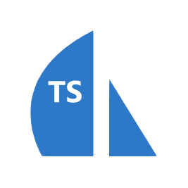

<p align="center">
  
</p>

# Sails-Typescript

<span class="badge-npmversion"><a href="https://npmjs.org/package/sails-typescript" title="View this project on NPM"></a></span>

This package provides TypeScript type definitions for SailsJS, allowing developers to leverage static typing when working with SailsJS applications. It aims to add comprehensive support for Sails projects through the use of generics.

## Installation

```bash
npm install --save sails-typescript
```

or

```bash
yarn add sails-typescript
```


## SailsJS Discord community
**Community Link:** [Join SailsJS Discord Community](https://discord.gg/VDH2yT6C)
Feel free to use this link to connect with the community and engage in discussions or ask any questions you may have.

---

## Why a New Sails-Typescript Module?

Previously, there were two separate modules for adding TypeScript support to Sails, and it was unclear which one to use. At the moment, we have combined aspects from both modules to cater to our starter, ensuring compatibility and ease of use.

As TypeScript and Sails continue to evolve, updates are essential to stay current with the latest features and improvements. While both TypeScript and Sails receive updates, albeit not always as rapidly as desired, the older modules were left unsupported.

Recognizing the need for a maintained solution, we forked from those older modules. Without their groundwork, this new module wouldn't have been possible. We're incredibly grateful for the opportunity to leverage static typing in Sails projects. We have a deep appreciation for Sails and its community, and we're committed to providing a seamless TypeScript experience for Sails developers.

--- 

## Acknowledgements

We would like to express our gratitude to the following individuals for their contributions to this project:

- **Ben Teichman**: For the original work on typing SailsJS. [Profile](https://github.com/effervescentia)
- **Jimmy Cann** For the original work on typing SailsJS. [Profile](https://github.com/yjimk)
- **Alexandro Libertino**: For Waterline types. [Profile](https://github.com/arvitaly)
- **Keith Kikta**:  For Waterline types. [Profile](https://github.com/newbish)

---

## Example Usage

Inside the `example` folder [link here](https://github.com/sails-adminpanel/sails-typescript/blob/master/example), you will find a comprehensive example demonstrating how to use this library in a Sails project. The example showcases the usage of generics and provides typings for all models, offering a practical guide for integrating Sails-Typescript into your projects.

---

## Contributing

Contributions are welcome! If you find any issues or have suggestions for improvements, please open an issue or submit a pull request on [GitHub](https://github.com/sails-adminpanel/sails-typescript).

The main idea behind this project is to achieve full TypeScript support for Sails. However, there are currently some challenges due to the need to use a starter and define everything globally within it. Efforts are underway to move towards a solution where only module renaming is required.

Additionally, there is a need for a pipeline to generate models, services, and helpers automatically. Contributions in these areas would greatly benefit the project and the Sails community as a whole.

Contributions of all kinds are welcome! Whether you're interested in improving typings, adding features, fixing bugs, or contributing to documentation, your input is valuable.

If you have any suggestions, find any issues, or have ideas for improvements, please don't hesitate to open an issue or submit a pull request on [GitHub](https://github.com/sails-adminpanel/sails-typescript).

Thank you for considering contributing to Sails-Typescript!

--- 

## License

This project is licensed under the MIT License - see the [LICENSE](LICENSE) file for details.

---